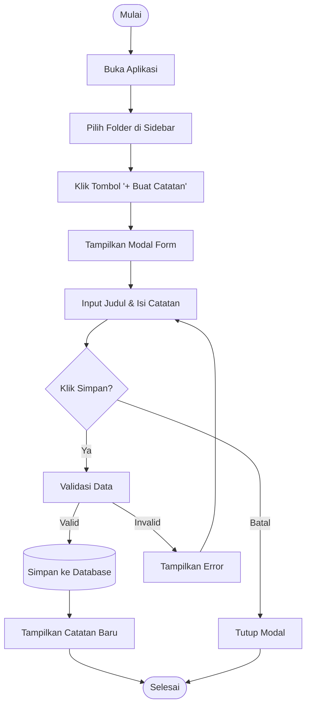

# 📝 Notepad Saya

**Notepad Saya** adalah aplikasi manajemen catatan berbasis web yang dirancang untuk membantu pengguna mengorganisir ide dan informasi dengan mudah. Aplikasi ini menawarkan antarmuka yang bersih, modern, dan responsif, memungkinkan pengguna untuk membuat folder, menyimpan catatan, serta mengedit dan menghapusnya sesuai kebutuhan.

Dikembangkan menggunakan framework **Laravel 12**, aplikasi ini menonjolkan performa yang cepat dengan kombinasi *Server-Side Rendering* (Blade) dan interaktivitas modern menggunakan JavaScript murni.


---

## ✨ Fitur Utama

### 1. 📂 Manajemen Folder
- **Buat Folder Baru**: Organisasikan catatan Anda ke dalam kategori yang berbeda.
- **Rename Folder**: Klik kanan pada folder untuk mengubah namanya.
- **Hapus Folder**: Hapus folder yang tidak lagi dibutuhkan (beserta seluruh catatan di dalamnya).
- **Context Menu**: Akses cepat fitur folder dengan klik kanan.

### 2. 📝 Manajemen Catatan
- **Buat Catatan**: Tambahkan catatan baru dengan judul dan isi yang dapat disesuaikan.
- **Edit Catatan**: Ubah konten catatan kapan saja melalui tombol edit (✎).
- **Hapus Catatan**: Hapus catatan yang sudah tidak relevan.
- **Empty State**: Tampilan informatif saat folder masih kosong.

### 3. 🎨 Antarmuka Modern
- **Desain Responsif**: Tampilan yang menyesuaikan dengan ukuran layar.
- **Interaksi Halus**: Menggunakan modal untuk form input dan animasi transisi yang lembut.
- **Tanpa Reload**: Pengalaman pengguna yang terasa seperti Single Page Application (SPA) untuk interaksi tertentu.

---

## 🛠️ Tech Stack

Aplikasi ini dibangun menggunakan teknologi terkini untuk memastikan performa, keamanan, dan kemudahan pengembangan:

| Kategori | Teknologi | Deskripsi |
| :--- | :--- | :--- |
| **Backend** |  **Laravel 12** | Framework PHP modern untuk logika bisnis & API. |
| **Database** |  **MySQL** | Sistem manajemen basis data relasional. |
| **Frontend** |  **Blade** | Templating engine bawaan Laravel. |
| **Styling** |  **Vanilla CSS** | Styling kustom tanpa framework CSS berat (seperti Bootstrap/Tailwind). |
| **Scripting** |  **Vanilla JS** | Interaktivitas DOM dan AJAX handling. |

---

## 🏗️ Arsitektur Sistem

Berikut adalah rancangan alur sistem aplikasi **Notepad Saya** menggunakan diagram UML.

### 1. Use Case Diagram

Diagram ini menggambarkan interaksi antara pengguna (User) dengan fitur-fitur yang tersedia di dalam sistem.

```mermaid
usecaseDiagram
    actor User as "Pengguna"
    
    package "Aplikasi Notepad Saya" {
        usecase "Kelola Folder" as UC1
        usecase "Kelola Catatan" as UC2
        
        usecase "Buat Folder" as UC1_1
        usecase "Rename Folder" as UC1_2
        usecase "Hapus Folder" as UC1_3
        
        usecase "Buat Catatan" as UC2_1
        usecase "Edit Catatan" as UC2_2
        usecase "Hapus Catatan" as UC2_3
        usecase "Lihat Catatan" as UC2_4
    }

    User --> UC1
    User --> UC2
    
    UC1 ..> UC1_1 : include
    UC1 ..> UC1_2 : include
    UC1 ..> UC1_3 : include
    
    UC2 ..> UC2_1 : include
    UC2 ..> UC2_2 : include
    UC2 ..> UC2_3 : include
    UC2 ..> UC2_4 : include
```

### 2. Activity Diagram

Diagram berikut menjelaskan alur aktivitas pengguna dalam melakukan dua tugas utama: **Membuat Catatan Baru** dan **Mengelola Folder (Rename/Delete)**.

#### A. Alur Membuat Catatan Baru



#### B. Alur Rename Folder (Context Menu)


---

## � Prasyarat & Instalasi

### Prasyarat
- PHP >= 8.2
- Composer
- MySQL Database

### Cara Instalasi

1.  **Clone Repository**:
    ```bash
    git clone https://github.com/username/notepad-saya.git
    cd notepad-saya
    ```

2.  **Install Dependencies**:
    ```bash
    composer install
    ```

3.  **Setup Environment**:
    - Copy `.env.example` ke `.env`.
    - Atur koneksi database:
    ```env
    DB_CONNECTION=mysql
    DB_HOST=127.0.0.1
    DB_PORT=3306
    DB_DATABASE=notepad_db
    DB_USERNAME=root
    DB_PASSWORD=
    ```

4.  **Generate Key & Migrate**:
    ```bash
    php artisan key:generate
    php artisan migrate
    ```

5.  **Jalankan**:
    ```bash
    php artisan serve
    ```
    Akses di `http://127.0.0.1:8000`.

---
Dibuat dengan ❤️ oleh [Nama Pengembang].
