# 📝 Notepad Saya (Web & Mobile)

**Notepad Saya** adalah ekosistem manajemen catatan lintas platform (Web & Mobile) yang dirancang untuk membantu pengguna mengorganisir ide dan informasi dengan mudah. 

## 🖼️ Preview Aplikasi

Berikut adalah tampilan antarmuka **Notepad Saya** yang modern dan responsif:

### 🌐 Tampilan Web

| Halaman Utama  | Folder Baru |
| :---: | :---: |
|  |  |

| Catatan Baru | Daftar Catatan |
| :---: | :---: |
|  |  |

### 📱 Tampilan Mobile

| Beranda Mobile | Daftar Catatan Mobile |
| :---: | :---: |
|  |  |

---

## ✨ Fitur Utama

### 1. 📂 Manajemen Folder
- **Buat Folder Baru**: Organisasikan catatan Anda ke dalam kategori yang berbeda dengan modal yang elegan.
- **Rename Folder**: Klik kanan pada folder untuk mengubah namanya secara instan.
- **Hapus Folder**: Hapus folder beserta isinya dengan konfirmasi keamanan.

### 2. 📝 Manajemen Catatan
- **Buat Catatan**: Tambahkan catatan dengan judul dan isi menggunakan modal yang fokus.
- **Edit & Hapus**: Tombol aksi yang cepat dan intuitif di setiap kartu catatan.
- **Visual Berwarna**: Kartu catatan otomatis memiliki warna yang berbeda untuk estetika yang menarik.

### 3. 📱 Aplikasi Mobile (Android)
- **Sinkronisasi Real-time**: Data yang Anda buat di web akan muncul di aplikasi mobile secara otomatis.
- **Navigasi Mudah**: Pindah antar folder dan lihat catatan dengan transisi yang halus.
- **Native Experience**: Dibangun secara native untuk performa terbaik di perangkat Android.

### 3. 🎨 Antarmuka Modern
- **Desain Responsif**: Tampilan yang menyesuaikan dengan ukuran layar.
- **Interaksi Halus**: Menggunakan modal untuk form input dan animasi transisi yang lembut.
- **Tanpa Reload**: Pengalaman pengguna yang terasa seperti Single Page Application (SPA) untuk interaksi tertentu.

---

## 🛠️ Tech Stack

Aplikasi ini dibangun menggunakan teknologi terkini untuk memastikan performa, keamanan, dan kemudahan pengembangan:

| Kategori | Teknologi | Deskripsi |
| :--- | :--- | :--- |
| **Backend** |  **Laravel 12** | Framework PHP modern untuk logika bisnis & API. |
| **Database** |  **MySQL** | Sistem manajemen basis data relasional. |
| **Frontend** |  **Blade** | Templating engine bawaan Laravel. |
| **Styling** |  **Vanilla CSS** | Styling kustom tanpa framework CSS berat (seperti Bootstrap/Tailwind). |
| **Scripting** |  **Vanilla JS** | Interaktivitas DOM dan AJAX handling. |

---

## 🏗️ Arsitektur Sistem

Berikut adalah rancangan alur sistem aplikasi **Notepad Saya** menggunakan diagram UML.

### 1. Use Case Diagram

Diagram ini menggambarkan interaksi antara pengguna (User) dengan fitur-fitur yang tersedia di dalam sistem.

```mermaid
flowchart LR
    %% Aktor
    User((Pengguna))

    %% Sistem
    subgraph Aplikasi["📦 Aplikasi Notepad Saya"]
        direction TB
        subgraph Folder["📂 Kelola Folder"]
            UC1_1([Buat Folder])
            UC1_2([Rename Folder])
            UC1_3([Hapus Folder])
        end
        subgraph Catatan["📝 Kelola Catatan"]
            UC2_1([Buat Catatan])
            UC2_2([Edit Catatan])
            UC2_3([Hapus Catatan])
            UC2_4([Lihat Catatan])
        end
    end

    User --> UC1_1
    User --> UC1_2
    User --> UC1_3
    User --> UC2_1
    User --> UC2_2
    User --> UC2_3
    User --> UC2_4
```



### 2. Activity Diagram

Diagram berikut menjelaskan alur aktivitas pengguna dalam melakukan dua tugas utama: **Membuat Catatan Baru** dan **Mengelola Folder (Rename/Delete)**.

#### A. Alur Membuat Catatan Baru


#### B. Alur Rename Folder (Context Menu)


---

## � Prasyarat & Instalasi

### Prasyarat
- PHP >= 8.2
- Composer
- MySQL Database

### Cara Instalasi

1.  **Clone Repository**:
    ```bash
    git clone https://github.com/nainggolanyosafat0/Apk-Notepad
    cd notepad-saya
    ```

2.  **Install Dependencies (Web)**:
    ```bash
    cd web
    composer install
    ```

3.  **Setup Environment**:
    - Copy `.env.example` ke `.env`.
    - Atur koneksi database:
    ```env
    DB_CONNECTION=mysql
    DB_HOST=127.0.0.1
    DB_PORT=3306
    DB_DATABASE=notepad_db
    DB_USERNAME=root
    DB_PASSWORD=
    ```

4.  **Generate Key & Migrate**:
    ```bash
    php artisan key:generate
    php artisan migrate
    ```

5.  **Jalankan**:
    ```bash
    php artisan serve
    ```
    Akses di `http://127.0.0.1:8000`.

---
Dibuat dengan [Yosapat Nainggolan].
